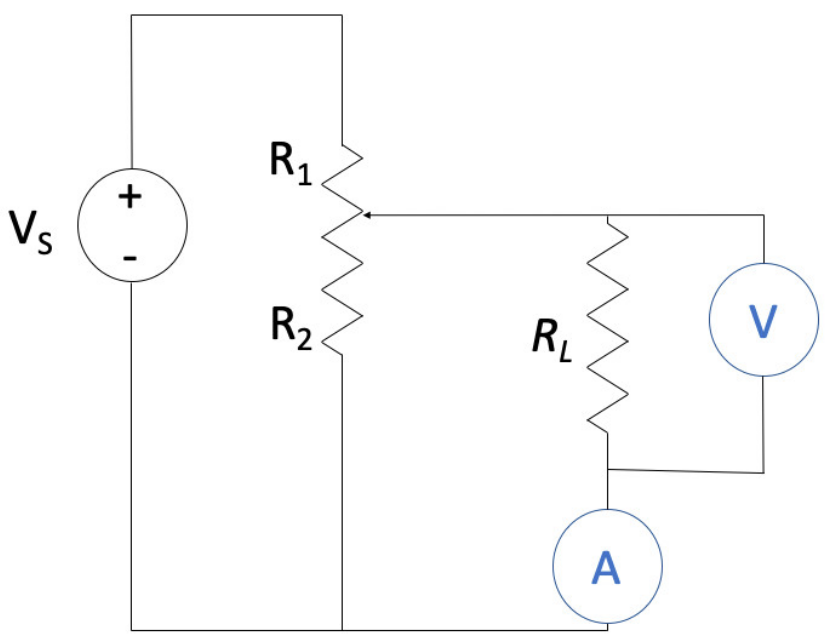

# circuit_sim
### Description
This project simulates an electrical circuit with time-dependent resistors and a constant voltage source. The simulation includes readings from a voltmeter and an ammeter at regular intervals and calculates the instantaneous and rolling average resistance based on these readings.
The circuit diagram is presented below:



Where:
- RL is a fixed resistor.
- VS is a DC voltage source (VS=10V).
- R1 and R2 are variable resistors.
- V is a voltmeter.
- A is an ammeter.


The project is written in Python and uses asyncio for concurrent execution.

# Installation
The project requires the basic Python installation (version >3.6).

# Running the Simulation
Run the main script from the terminal:
```
python main.py
```
### Project Structure
- main.py: The main script to run the simulation.
- classes.py: Contains the definitions of the classes used in the simulation.
- README.md: This file.
- circuit.png: Diagram of the simulated circuit.
- Assignment.pdf: Problem statement.
